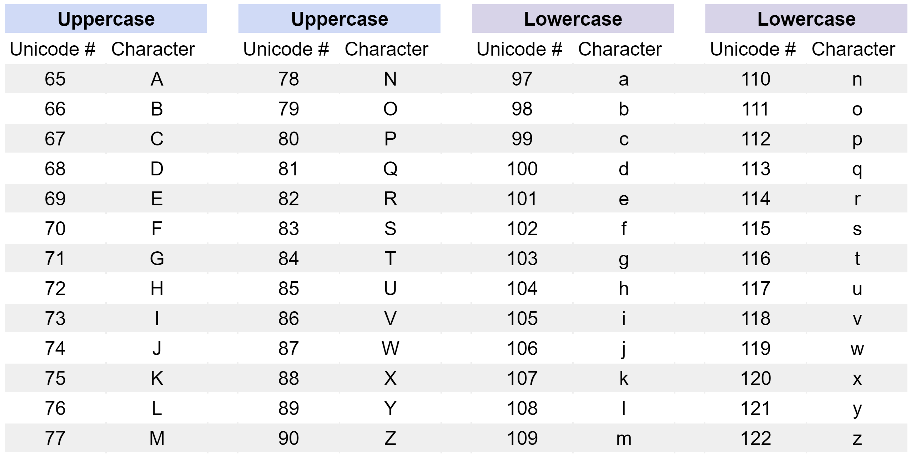

# Study Guide: Conditionals

### **Knowledge**
#### Comparison operators with numerical values
Comparison expressions return a Boolean result (True or False)
* x == y    If x is equal to y, return True. Else, return False.
* x == y    If x is equal to y, return True. Else, return False.
* x != y    If x is not equal to y, return True. Else, return False.
* x < y     If x is less than y, return True. Else, return False.
* x <= y    If x is less than or equal to y, return True. Else, return False.
* x > y     If x is greater than y, return True. Else, return False.
* x >= y    If x is greater or equal to y, return True. Else, return False.

#### Comparison operators with strings
Comparison expressions with strings also return a Boolean result (True or False).
* "x" == "y"  If the words are the same, return True. Else, return False.
* "x" != "y"   If the words are not the same, return True. Else, return False.
When used with strings, the following comparison expressions will alphabetize the strings.
* "x" < "y"   	If string "x"  has a smaller Unicode value than string "y", return True.  Else, return False.
* "x" <= "y" 	If the Unicode value for string "x" is smaller than or equal to the Unicode value of string "y", return True. Else, return False.
* "x" > "y"    	If string "x" has a larger Unicode value than string "y", return True. Else, return False.
* "x" >= "y"  	If the Unicode value for string "x" is greater than or equal to the Unicode value of string "y", return True. Else, return False.

**Unicode values for the alphabet**

 The Unicode numbering for the alphabet starts at 65 for capital letter A and runs to 90 for capital letter Z. Then, the lowercase alphabet values start at 97 for lowercase a and run to 122 for lowercase z. Using these Unicode numbers, capital A's code is less than the codes of all other letters, which Python interprets as the beginning of the alphabet. Lowercase z's code is greater than the codes of all other letters, which Python interprets as the ultimate end of the English alphabet.

#### Logical Operators
Logical operators are used to combine comparison expressions and also return Boolean results (True or False).
* comparison1 **and** comparison2 
    * Returns a True result if both comparison1 and comparison2 are true.
    * If they are not both true, return False.
* comparison1 **or** comparison2 
    * Returns a True result if either comparison1 and/or comparison2 are True. 
    * If neither comparison is true, return False.
* **not** comparison1
    * Returns the inverse Boolean value of the comparison.
        * Returns a True result if comparison1 is false.
        * If comparison1 is true, then returns False.

#### Syntax of an if-else-elif block
```python
if condition1:
    action1
elif condition2:
    action2
else:
    action3
```
* If condition1 is true
    * Then perform action1 and exit if-else-elif block
* If condition2 is true
    * Then perform action2 and exit if-else-elif block
* If condition3 is true
    * Then perform action3 and exit if-else-elif block